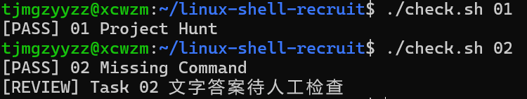
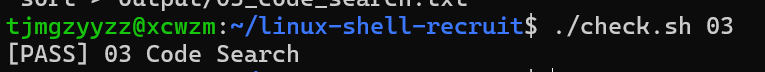
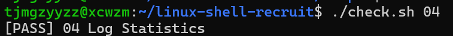
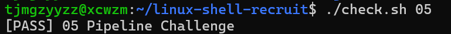
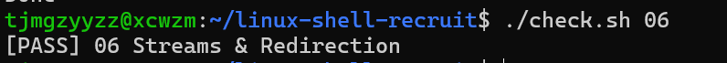
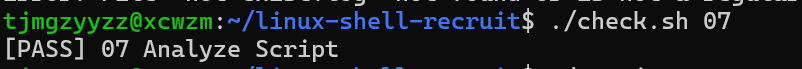
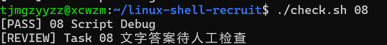

# 任务作答记录与心得体会
## 使用了claude code辅助完成
## 任务一（Task 01 — Project Hunt）

### 作答过程

拿到题目后，我先到菜鸟教程上了解了一下几个可能用到的 Linux 命令的用法，再根据题目给出的提示（"它可能不是默认可见的文件"）推断项目编号藏在隐藏文件里。

1. 用 `ls -a` 查看 `workspace/` 目录，发现除了默认可见的 `project` 和 `src` 之外，还有一个以点开头的隐藏目录 `.project`。
2. 用 `grep` 在子目录中检索内容，锁定含有关键字 `PROJECT_ID` 的文件就是 `workspace/.project/metadata`。
3. 用 `cat` 显示 `.project/metadata` 的内容，找到了项目编号 `LSR-2026-0831`，把它写入 `output/01_project_id.txt`。
4. 接着学习了相对路径与绝对路径的概念，从 `workspace/src/utils/` 出发，逐层向上用 `..` 回到 `workspace/`，再进入 `.project` 目录，得到相对路径 `../../.project/metadata`，写入 `output/01_relative_path.txt`。

### 心得体会

这道题让我真正理解了"隐藏文件"和"路径"这两个基础概念。以前只知道 `ls`，没注意过 `ls -a` 能看到以 `.` 开头的隐藏文件；`grep` 也第一次体会到它不仅能查代码，还能用来在文件内容里定位关键字。相对路径的部分刚开始容易绕晕，但理清"`.` 是当前目录、`..` 是上一级目录"之后，从 `workspace/src/utils` 出发需要上两级再进 `.project`，`../../.project/metadata` 这个写法就顺理成章了。

## 任务二（Task 02 — Missing Command）

### 作答过程

根据题目提示先了解了执行权限相关的知识。

1. 用 `ls -l` 查看 `tools/recruit-info`，发现它的权限里没有 `x`（执行权限），所以直接运行会报错。
2. 用 `chmod +x tools/recruit-info` 给它加上执行权限，这样 `./tools/recruit-info` 就能运行了。
3. 关于为什么需要 `./`：直接输入 `recruit-info` 时，Shell 只会到 `PATH` 环境变量列出的目录里去找可执行文件，而当前目录 `tools/` 通常不在 `PATH` 里，所以找不到。
4. 最后用 `export` 把 `tools/` 目录加入当前会话的 `PATH`，让 `recruit-info` 在当前窗口和它启动的子程序里都能直接执行。

### 心得体会

这道题把"权限"和"命令查找机制"讲清楚了。`chmod +x` 解决了"文件本身能不能执行"，而 `PATH` 解决的是"Shell 去哪里找命令"——两者是两回事，之前总是混在一起。用 `ls -l` 看权限位、理解 `x` 的含义，再亲手把目录 `export` 进 `PATH`，才真正明白为什么系统自带的 `ls` 不用加路径就能用，而自己写的脚本要先 `./` 一下。`export` 的作用范围也很有意思，它只对当前会话有效，不会像改 `.bashrc` 那样永久生效，这一点符合题目"不修改 `.bashrc`"的要求。

## 任务三（Task 03 — Code Search）

### 作答过程

题目要求在 `workspace/project/` 里找出所有包含 `TODO` 或 `FIXME` 的普通文件，并且每个路径只出现一次、按字典序排列。

1. 用 `grep -rlE "TODO|FIXME" workspace/project/` 递归检索目录，只列出包含 `TODO` 或 `FIXME` 的文件路径（`-r` 递归、`-l` 只输出文件名、`-E` 支持 `|` 匹配多个关键字）。
2. 用 `sort` 把得到的文件路径按字典序排列。
3. 用 `uniq` 检查并去掉重复的路径。
4. 最后把结果重定向写入 `output/03_code_search.txt`。

整条命令可以串成一条管道：`grep -rlE "TODO|FIXME" workspace/project/ | sort | uniq > output/03_code_search.txt`。

### 心得体会

这道题第一次让我把多个命令串起来用，体会到了管道 `|` 的威力——前一个命令的输出直接变成下一个命令的输入。其中印象最深的是 `uniq` 的一个坑：它只能去掉**相邻**的重复行，所以必须先 `sort` 再 `uniq`，否则重复路径去不干净。`grep` 的参数也进一步熟悉了：`-r` 递归、`-l` 只列文件名（而不是打印匹配内容）、`-E` 打开正则让 `|` 表示"或"。题目要求"字典序"，正好对应 `sort` 的默认行为，一条命令就搞定了。

## 任务四（Task 04 — Log Statistics）

### 作答过程

题目要求分析 `logs/server.log`，共三个输出：ERROR 条数、出现 ERROR 的用户名、出现次数最多的错误码。

1. 用 `grep -c "ERROR" logs/server.log` 统计出 ERROR 的总条数，写入 `output/04_error_count.txt`。
2. 用 `cat` 查看 `logs/server.log`，确认每行日志的格式是「时间 级别 user=用户名 code=错误码」；再用 `grep` 筛出 ERROR 行并提取其中的用户名，去重后按字典序排列，写入 `output/04_error_users.txt`。
3. 对各 ERROR 行的错误码做计数，找出出现次数最多的那个，写入 `output/04_top_code.txt`。

### 心得体会

这道题让我体会到了"先读数据、再定命令"的思路：先 `cat` 通读一遍日志，把每行的字段结构看清楚，才知道该用 `grep` 提取哪一部分、用什么分隔符。统计上也有新收获——`grep -c` 能直接数出匹配行数，比 `grep ... | wc -l` 更简洁；而去重排序仍是 `sort | uniq` 的老搭档，其中 `uniq -c` 还能顺便统计每个值出现的次数，正好用来找出"出现次数最多的错误码"，再配合按次数排序就能定位到第一名。

## 任务五（Task 05 — Pipeline Challenge）

### 作答过程

先通过菜鸟教程和 DeepSeek 了解了标准输出（stdout）、标准输入（stdin）以及管道 `|` 的概念：管道能把前一个命令的标准输出直接变成后一个命令的标准输入，不用落地成临时文件——这正是本题"不允许创建 temp1.txt 等中间文件"的原因。

1. 用 `cut -d' ' -f 1 access.log` 按空格切分每行，取第一个字段，得到所有请求的 IP。
2. 用 `sort | uniq -c` 先把 IP 排序，再统计每个 IP 出现的次数。
3. 用 `sort -nr` 按出现次数从多到少排序，`head -1` 取次数最多的那一行。
4. 再用 `awk '{print $2}'` 只留下 IP 本身（去掉前面的计数），重定向写入 `output/05_top_ip.txt`。

完整命令：`cut -d' ' -f 1 access.log | sort | uniq -c | sort -nr | head -1 | awk '{print $2}' > output/05_top_ip.txt`

### 心得体会

这道题让我第一次真正把管道"串"起来解决一个完整问题。最大的收获是理解了 stdout/stdin 和 `|` 的关系——数据像水流一样在命令之间传递，全程不落盘，既快又不用管理一堆临时文件。`cut` 的参数也清楚了：`-d' '` 指定分隔符是空格，`-f 1` 取第一列。统计"出现次数最多"的套路也记下来了：`sort | uniq -c | sort -nr | head -1`，其中 `uniq -c` 必须先 `sort` 才能正确计数，这一步是整个链条的关键。

## 任务六（Task 06 — Streams & Redirection）

### 作答过程

题目要求运行 `./tools/check-project`——它会同时输出正常信息和错误信息，需要把两条流分别存下来，再用 `tee` 实现"既显示又保存"。

1. 用 `./tools/check-project > output/06_stdout.txt` 把标准输出（stdout）重定向保存到 `output/06_stdout.txt`。
2. 用 `./tools/check-project 2> output/06_stderr.txt` 把标准错误（stderr）重定向保存到 `output/06_stderr.txt`。
3. 用 `./tools/check-project | tee output/06_tee.txt` 再运行一次，让正常输出既显示在终端、又通过 `tee` 同时写入 `output/06_tee.txt`。

### 心得体会

这道题让我彻底分清了 stdout 和 stderr 两个流。脚本里 `echo` 走标准输出（文件描述符 1），`echo ... >&2` 走标准错误（文件描述符 2），两者默认都打到屏幕上，所以平时感觉混在一起，其实是两条独立的通道。`>` 默认只重定向 stdout，`2>` 专门重定向 stderr——所以错误信息得用 `2>` 才能单独接住。`tee` 则像个"三通管"，把管道进来的数据一边原样打印到屏幕、一边写进文件，名字也来自这种 T 形分叉。另外还留意到 `| tee` 只接 stdout，stderr 仍会直接上屏，想把两条流一起处理就得 `2>&1 | tee`。

## 任务七（Task 07 — Analyze Script）

### 作答过程

题目要求补全 `scripts/analyze.sh`，让它从命令行参数读日志路径，并做参数校验和日志分析。

1. 用 `if [[ $# -eq 0 ]]` 判断有没有传参数：`$#` 是参数个数，等于 0 说明没传，此时打印 `Usage` 提示并以 `exit 1`（非零状态）退出。
2. 用 `if [[ ! -f "$1" ]]` 判断第一个参数是不是一个存在的普通文件：`-f` 测试文件是否存在且是普通文件，`!` 取反；不满足时打印错误提示并 `exit 1` 退出。
3. 校验通过后，用 `$(...)` 命令替换拿到两个结果——`grep -c "ERROR" "$1"` 统计 ERROR 条数存入变量中，`cut -d ' ' -f 5 "$1" | cut -d '=' -f 2 | sort | uniq -c | sort -nr | head -n 1 | awk '{print $2}'` 找出出现次数最多的错误码存到变量中。
4. 最后按 `Total ERROR: ${error_count}` 和 `Top Code: ${top_code}` 的格式输出。

### 心得体会

这是第一次自己写一个带参数校验的 Shell 脚本，最大的体会是"健壮性靠校验"：程序不能假设输入一定是好的，得先判断参数有没有传、文件存不存在，出错时用非零的 `exit` 状态告诉调用方"我失败了"。`$#`（参数个数）和 `$1`（第一个参数）这种位置参数，加上 `[[ ]]` 测试表达式里的 `-f`、`-eq`、`!` 取反，都是脚本编程的基本功。`$(...)` 命令替换也很有用，能把一条命令的输出赋给变量再继续用。

## 任务八（Task 08 — Script Debug）

### 作答过程

题目给的 `scripts/batch-copy.sh` 基本能跑，但遇到带空格的文件名会出错。根据提示先了解了 `$@` 和 `"$@"` 的区别，然后通读脚本定位问题。

1. 阅读 `scripts/batch-copy.sh`，发现两处变量没有加引号：`for file in $@` 和 `cp $file $destination/`。
2. 未加引号的 `$@` 和 `$file` 会被 Shell 做"单词拆分"（word splitting）：像 `My Report.txt` 这种带空格的文件名会被拆成 `My` 和 `Report.txt` 两个词，导致 `cp` 找不到文件或复制错目标。
3. 给它们加上双引号：`for file in "$@"`、`cp "$file" "$destination/"`（`$destination` 也一并加上引号）。
4. 在 `answers/08.md` 里回答"为什么 `$var` 和 `"$var"` 有时结果不同"。

### 心得体会

这道题让我真正理解了"引号"和"单词拆分"。Shell 展开一个没加引号的变量时，会按 IFS（默认是空格、制表符、换行）把它拆成多个参数，所以 `My Report.txt` 会变成 `My` 和 `Report.txt` 两个词；加上双引号 `"$var"` 后，变量被当作一个整体传出去，空格就保住了。`"$@"` 又是位置参数专用的写法——它既能保持每个参数各自独立，又不会被二次拆分，是 `for` 循环遍历参数的标准姿势。这个坑平时文件名没空格时完全看不出来，一旦遇到带空格的文件名就立刻翻车，属于脚本里最隐蔽的一类 bug。

## 验证结果

任务一、任务二的 `check.sh` 判断程序运行通过：

任务三的 `check.sh` 判断程序运行通过：

任务四的 `check.sh` 判断程序运行通过：

任务五的 `check.sh` 判断程序运行通过：

任务六的 `check.sh` 判断程序运行通过：

任务七的 `check.sh` 判断程序运行通过：

任务八的 `check.sh` 判断程序运行通过：

